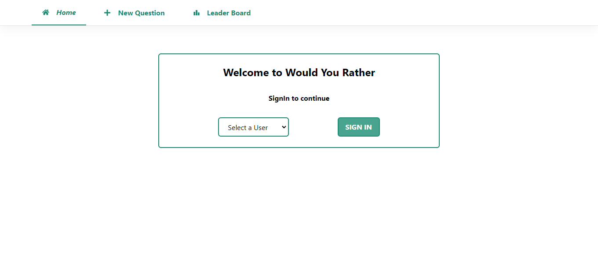
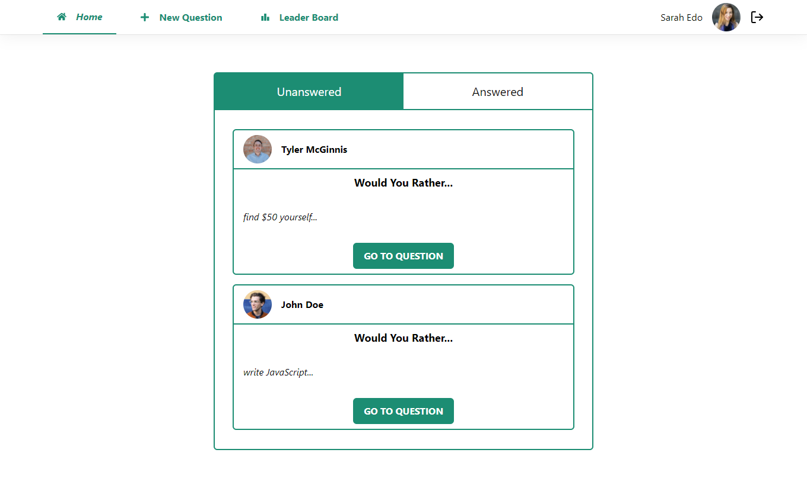
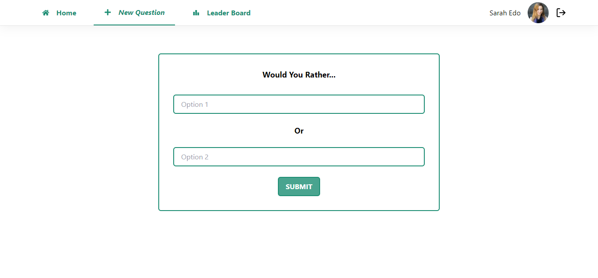
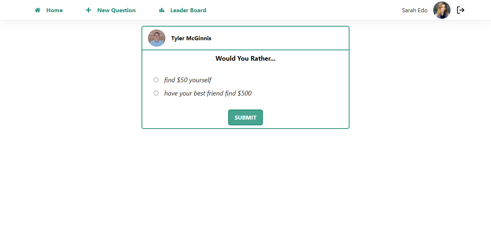
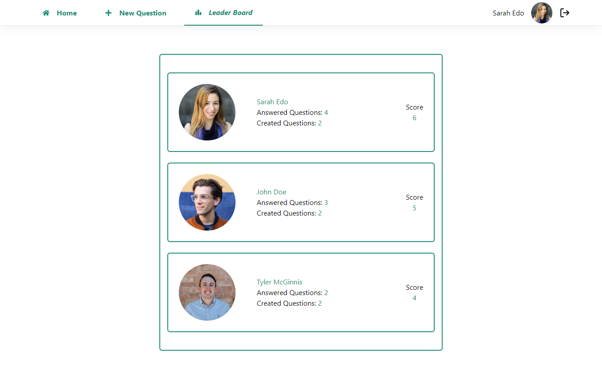

# Would You Rather Project

This is a solution to the [Calculator app challenge on Frontend Mentor](https://www.frontendmentor.io/challenges/calculator-app-9lteq5N29). Frontend Mentor challenges help you improve your coding skills by building realistic projects. 

## Table of contents

- [Overview](#overview)
  - [Screenshot](#screenshot)
  - [Links](#links)
  - [Built with](#built-with)
  - [Useful resources](#useful-resources)
- [Author](#author)

## Overview
Would You Rather Project
Second project at Advanced Front-End Web Development Nanodegree Program

### Screenshot

### Links

- Solution URL: [Solution](https://github.com/joey493/reactnd-project-would-you-rather)
- Live Site URL: [live Site](https://suspicious-boyd-a8a38d.netlify.app)

### Built with

- HTML
- CSS
    - Sass
    - tailwind
- JavaScript
    - React
        - JSX
        - Router
    - Redux

### Useful resources

- [React documents](https://reactjs.org/)
- [redux docs](https://redux.js.org/)
- [tailwind docs](https://tailwindcss.com/)
- [Udacity](https://www.udacity.com/)
- [git repo](https://github.com/M-Bohram/udacity-would-you-rather) - design inspiration

## Author

<!-- - Website - [Add your name here](https://www.your-site.com) -->
- Twitter - [@ibrahim33996](https://twitter.com/ibrahim33996)
- LinkedIn - [Ibrahim](https://www.linkedin.com/in/ibrahim-nader-3a65351b6/)

